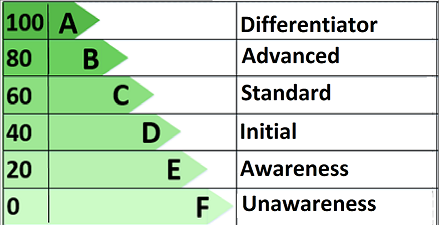

# Source Code Strategy Assessment Framework

## The Value of This Assessment

The assessment helps you to discover and exploit opportunities to...

- Increase business & customer value

- Reduce costs

- Increase quality

- Increase employee satisfaction

- Transform culture from silos to collaboration

Opportunities might be any combination of short-term, medium-term, long-term.

## Definition of Source Code

Any "codified" knowledge related to...

- Products, solutions, publications or services

- The full life-cycle of the above

- Examples:

  - Production application or service source code and configuration

  - Test automation source code and configuration

  - Product or service documentation (including for developers, service or users)

  - Infrastructure, build, deployment and monitoring code and configuration

## Assessees

- Groups of any size can use this framework

- You will get better value from the assessment with a cohesive group
with more than twenty people, such as a business

- Assessment value increases if the assessed group is (or aspires to be)
part of a larger organization of groups and external ecosystems

## Assessment Model

Provided questions and indicators are examples. They are not a checklist.
Meeting every example indicator does not guarantee a score.
Scoring will be a discussion. If you have good
reasons and supporting data for your approach, even if it does not align with
this framework, you may still be scoring high for your source code strategy.

Generic scoring guidance is [here](scores.csv)

## How To Use This Framework

While measurement framework emerges, you can get a structured reference to learn
what parts of your source code strategy assessment are relevant. You will also
find examples of the type questions and indicators you could look as reference
to derive a maturity level and subsequently suggestions or ideas on potential
improvement actions.

## How To Contribute

We welcome your contribution - small or big - with your thoughts, proposals
for missing areas, potential questions or indicators...
